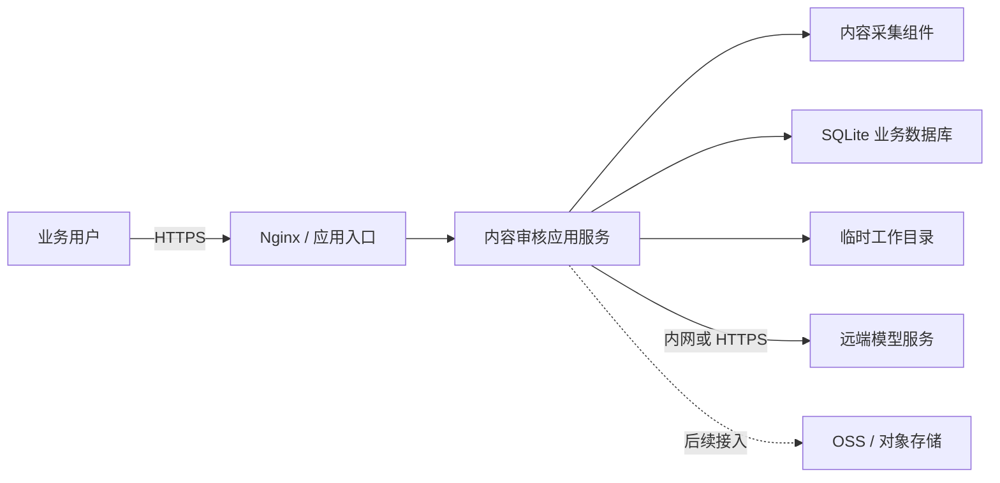

# 内容审核平台纯应用端部署资源建议

> 文档版本：V1.1
> 更新日期：2026-07-23
> 适用范围：不含模型推理服务器，不含原始音视频及爬取内容的长期存储

## 1. 建议结论

在模型推理全部由远端服务承担、原始媒体不在应用服务器长期保存，并且同一时间只运行一个审核任务的前提下，建议首期采用以下配置：

```text
4 核 CPU / 8 GB 内存 / 100 GB SSD / 20 Mbps 以上网络 / 无 GPU
```

条件允许时，建议网络带宽配置为 50 Mbps，或让应用服务与模型服务通过同一 VPC 内网通信。

**8 核 CPU、16 GB 内存不是首期部署的必选配置。** 只有在需要同时运行两个审核任务、长视频占比较高，或实际监控显示资源持续紧张时，才建议升级到 8C16G。

## 2. 评估边界

本次应用端配置包含：

- Web 前端、Nginx 和 FastAPI API 服务
- 任务创建、状态管理和审核结果展示
- 内容采集程序及 Playwright Chromium
- FFmpeg 音频提取和 OpenCV 视频关键帧处理
- SQLite 业务数据库、配置和必要日志
- 调用远端 VLM、LLM、OCR、ASR 和翻译服务

本次配置不包含：

- VLM、LLM、OCR、ASR 和翻译模型的 GPU 推理服务器
- 原始音频、视频、图片及爬取内容的长期存储
- 候选帧、临时音频等中间文件的长期存储
- OSS 或其他对象存储的容量及费用
- 数据仓库、大数据分析平台和灾备中心资源

本建议成立需要满足以下运行条件：

1. 模型推理全部通过远端服务或云端 API 完成，应用服务器不加载本地 AI 模型。
2. 同一时间只运行一个采集和审核任务，采集并发保持为 1。
3. 原始媒体和处理中间文件在任务完成后清理，或转存至 OSS 等外部存储。
4. 应用服务采用单实例、单 Uvicorn worker 部署。

如果暂时不能完成临时文件清理或 OSS 转存，则 100 GB 磁盘只适合短期试运行，不能作为长期容量承诺。

## 3. 推荐架构



OSS 用于承载媒体和证据文件，其容量、生命周期及费用独立规划，不计入应用服务器配置。

## 4. 配置分档

| 使用阶段 | CPU | 内存 | 本地磁盘 | 网络 | 并发边界 | GPU |
| --- | ---: | ---: | ---: | ---: | --- | --- |
| 开发或功能验证 | 2 核 | 4 GB | 50 GB SSD | 10-20 Mbps | 不建议运行长视频任务 | 不需要 |
| **首期客户部署，推荐** | **4 核** | **8 GB** | **100 GB SSD** | **20 Mbps 起，建议 50 Mbps** | **同时 1 个审核任务** | **不需要** |
| 业务扩容 | 8 核 | 16 GB | 200 GB SSD | 50-100 Mbps | 最多同时 2 个审核任务 | 不需要 |

2C4G 可以启动前端和 API，但 Chromium、FFmpeg、OpenCV 同时运行时余量较小，因此不建议作为正式交付配置。4C8G 是当前应用形态下更均衡的起配规格。

## 5. 配置核算依据

### 5.1 CPU

应用端主要消耗 CPU 的环节是内容采集、视频解码、音频提取、场景变化检测和图片拼接。当前单任务流程以逐条处理为主，采集和 OCR 并发均为 1，大部分模型调用时间用于等待远端响应。

因此：

- 4 核足以支撑一个审核任务和正常的页面/API 访问。
- 8 核主要用于两个任务并行，或减少长视频本地预处理对页面请求的影响。
- 继续增加 CPU 不一定线性提升速度，整体吞吐还受到远端模型响应和内容平台限速影响。

建议选择通用型实例，不建议使用长期受 CPU 积分限制的突发性能实例。

### 5.2 内存

单任务运行时的主要内存使用者包括：

| 组件 | 典型用途 |
| --- | --- |
| 操作系统、Nginx 和文件缓存 | 基础运行及磁盘缓存 |
| FastAPI、SQLite 和任务状态 | API、结果查询及任务执行 |
| Playwright Chromium | 内容采集和账号登录 |
| FFmpeg、OpenCV 和图片处理 | 单条视频预处理 |

后端新进程本身占用较低，历史长时间运行后的应用进程峰值也低于 1 GB。考虑 Chromium、视频处理进程、系统缓存和安全余量后，8 GB 能满足单任务部署。

以下情况建议升级到 16 GB：

- 同时运行两个审核任务
- 长视频或高分辨率视频占比较高
- 内存使用率持续超过 80%
- 出现 Swap 使用或系统触发进程回收

### 5.3 本地磁盘

排除媒体长期存储后，建议的 100 GB 本地 SSD 可按以下方式理解：

| 用途 | 建议预留 |
| --- | ---: |
| 操作系统及基础软件 | 20 GB |
| 应用代码、Python 环境、Chromium 和发布包 | 10 GB |
| SQLite、配置、日志及备份缓冲 | 15 GB |
| 单任务临时媒体和视频处理空间 | 40 GB |
| 安全余量 | 15 GB |
| **合计** | **100 GB** |

现有样本中，单条复杂视频的候选帧临时目录可能达到数 GB，因此仍需保留足够的临时工作空间。建议将临时目录放在 SSD 上，并设置容量告警和自动清理策略。

100 GB 配置不承担任何媒体长期归档责任。需要保留原始视频、采集内容或审核证据文件时，应转存 OSS，并按照每日处理量和保留周期单独计算对象存储容量。

### 5.4 网络

应用服务器需要从内容平台下载媒体，并向远端模型服务上传图片、审核拼图和音频。网络带宽主要影响任务处理时长，不会明显影响 Web 页面本身。

- 20 Mbps 可满足单任务起步运行。
- 50 Mbps 更适合正式环境，可缩短媒体下载和远端上传时间。
- 如果模型服务位于同一 VPC，应优先走内网，不必单纯依靠公网带宽解决模型通信问题。
- 如果客户网络存在代理、出口白名单或跨区域访问，应在上线前完成连通性测试。

## 6. 为什么使用一个 Uvicorn worker

一个 Uvicorn worker 是一个独立的后端应用进程，并不代表只能服务一个用户。单个 worker 仍然可以并发处理多个普通页面和 API 请求。

当前审核任务在应用进程内部执行，并使用本地 SQLite 和临时文件目录，因此首期建议：

- 1 个应用实例
- 1 个 Uvicorn worker
- 1 个采集并发
- 同时 1 个审核任务

如果未来需要多实例或更高任务并发，应先引入独立任务队列、共享存储和服务化数据库，再增加 worker 或应用副本。

## 7. 扩容判断标准

建议上线后持续观察 2-4 周，再依据监控数据决定是否升级到 8C16G。满足以下任一条件时，可以考虑扩容：

- CPU 使用率连续 15 分钟超过 70%
- 内存使用率持续超过 80%，或出现 Swap
- 临时目录使用率持续超过 70%
- 页面/API 在视频处理期间出现明显延迟
- 业务明确要求同时运行两个审核任务
- 任务等待时间已经不能满足业务要求

如果瓶颈来自远端模型响应或平台采集限速，增加本地 CPU 和内存不会明显提升吞吐，应优先检查模型服务和网络链路。

## 8. 软件和运维要求

| 项目 | 建议要求 |
| --- | --- |
| 操作系统 | Ubuntu Server 22.04 LTS 或 24.04 LTS，x86_64 |
| Python | Python 3.11 |
| 视频处理 | FFmpeg |
| 内容采集 | Playwright Chromium 及相关系统依赖 |
| Web 入口 | Nginx，启用 HTTPS |
| 应用服务 | FastAPI + Uvicorn，单 worker |
| 数据库 | SQLite，放置在持久化应用目录 |
| 进程管理 | systemd、Supervisor 或等效容器管理能力 |
| 监控 | CPU、内存、磁盘、进程、接口和任务状态监控 |

前端应在发布阶段完成构建，服务器运行时不要求安装 Node.js。

## 9. 存储与安全边界

### OSS 或对象存储

- 原始音视频、采集内容和证据文件的长期存储不计入应用服务器配置。
- 应配置独立访问凭证、生命周期规则和必要的备份策略。
- 对象存储暂未接入时，必须限制任务规模并定期清理本地临时文件。

### 基础安全要求

- 所有外部访问统一通过 HTTPS。
- API 密钥和模型服务凭证不得写入前端或代码仓库。
- 限制 CORS 来源、管理端访问范围和服务器开放端口。
- 采集账号凭证及登录状态必须加密存储。
- SQLite、配置和加密密钥应定期备份并验证可恢复性。

## 10. 最终建议

面向当前纯应用端部署，建议客户首期采购：

```text
应用服务器：4 vCPU / 8 GB RAM / 100 GB SSD
网络要求：公网 20 Mbps 起，建议 50 Mbps；模型通信优先走内网
部署方式：单实例 / 单 Uvicorn worker / 同时 1 个审核任务
GPU：不需要
```

该配置是当前边界下的正式起配建议，不是勉强运行的最低配置。8C16G 作为后续扩容档保留，不建议在业务量和监控数据尚未证明有需要时提前采购。
